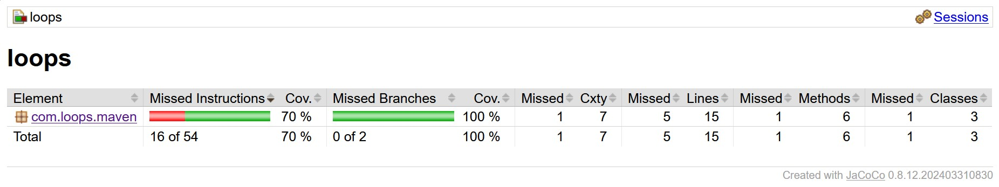

# loops-java-simoneaa

# Descripción


Crea una clase que tenga la responsabilidad de crear la tabla de multiplicar de un número. Dado un número entero, n, devuelva su tabla de multiplicar (del 1 al 10). Cada múltiplo n * i (donde 1 <= i => 10) debe imprimirse en una nueva línea en la forma: n x i = resultado.

Ejemplo: dado n = 5  

Output:  
5 x 1 = 5  
5 x 2 = 10  
5 x 3 = 15  
5 x 4 = 20  
5 x 5 = 25  
5 x 6 = 30  
5 x 7 = 35  
5 x 8 = 40  
5 x 9 = 45  
5 x 10 = 50  

# Requisitos

- Java 21
- Maven 3.6.3 o superior

## Cómo ejecutar

**Compilar y ejecutar tests:**  
```
mvn clean test
```

**Ver reporte de cobertura:**  
```
mvn clean verify  
```

**Luego abrir target/site/jacoco/index.html en el navegador**

# Testing


